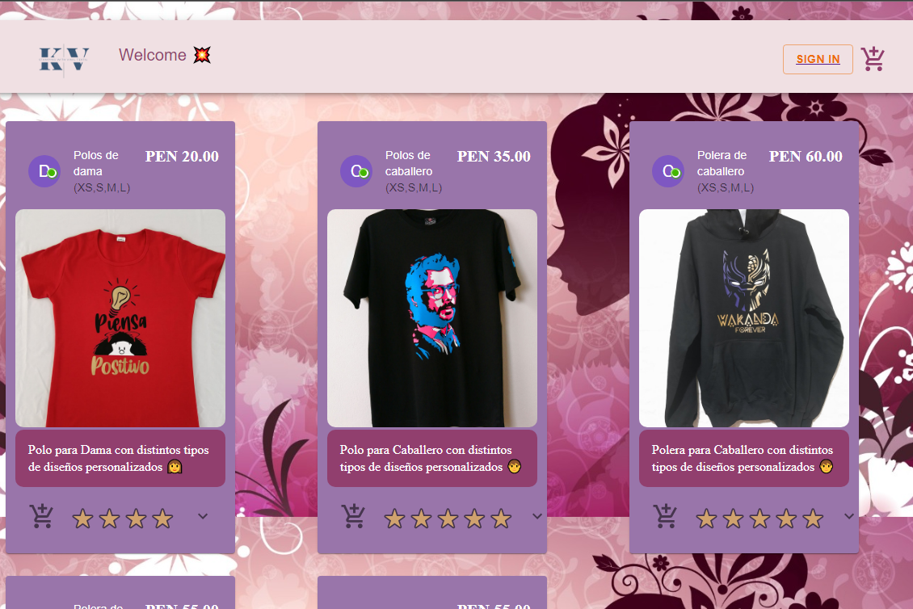
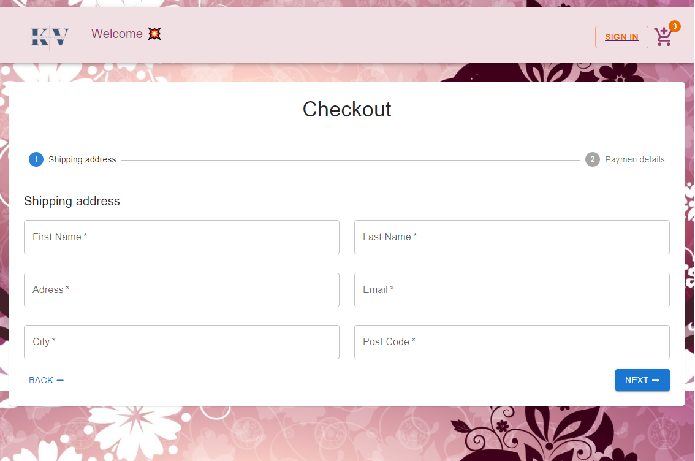
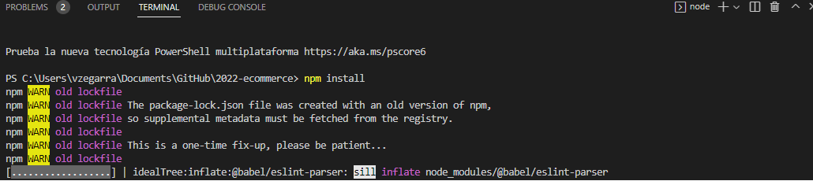
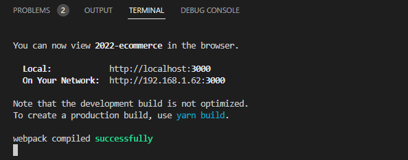

# Welcome to the Ecommerce - Stamping with Vinil Textil App 👕👖

An application whose purpose is to acquire through a payment system the different products 
printed with the different varieties of designs made of textile vinyl. 
With a print with an advanced level in durability and neatness; passing from polo shirts for ladies and for gentlemen, 
as well as jacket for ladies and for gentlemen. Also unisex caps

# Steps to run the project 🚨:

  
  
  
  
  
  

1.- Once the project is downloaded, Once the project is downloaded, access the terminal of your console.

    * - To access open the terminal (Control + Ñ) or (Terminal - New Terminal).
    * - Run the command "npm install"
   

  

Once having both steps perfectly, we proceed to execute the environments

  

## More info about me: 

Ing. Kevin J. Montero Zea 

CE: 004712881 🆔

+51-913-695-382 📱

<a href="https://www.linkedin.com/in/kevin913montero/">
    LinkedIn 👨‍🦰
  </a>

<a href="https://portfoliokjmz.netlify.app/">
    Portfolio 💼
  </a>

