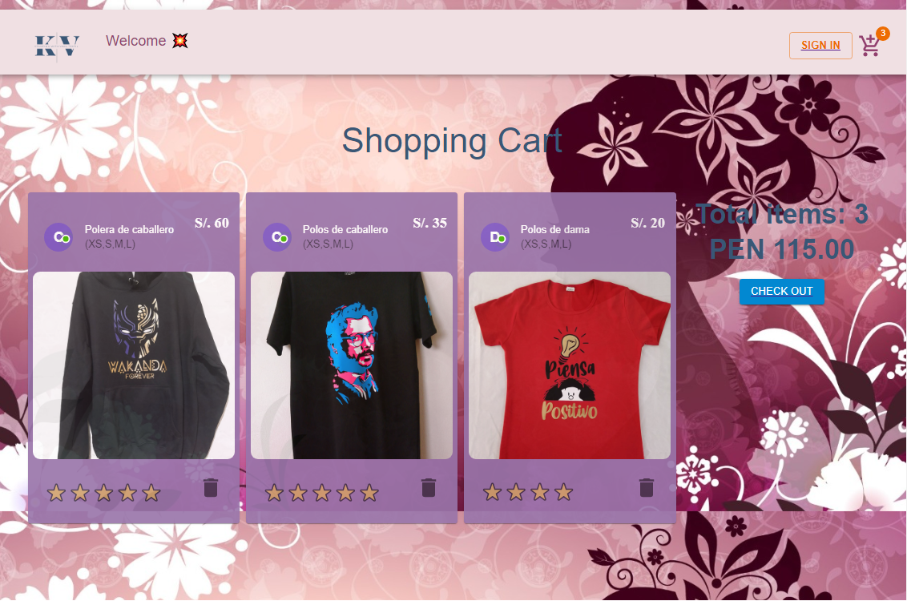

# Welcome to the Ecommerce - Stamping with Vinil Textil App 👕🩳👖

An application whose purpose is to acquire through a payment system the different products 
printed with the different varieties of designs made of textile vinyl. 
With a print with an advanced level in durability and neatness; passing from polo shirts for ladies and for gentlemen, 
as well as jacket for ladies and for gentlemen. Also unisex caps

# Steps to run the project:

  
  
  
  
  
  

